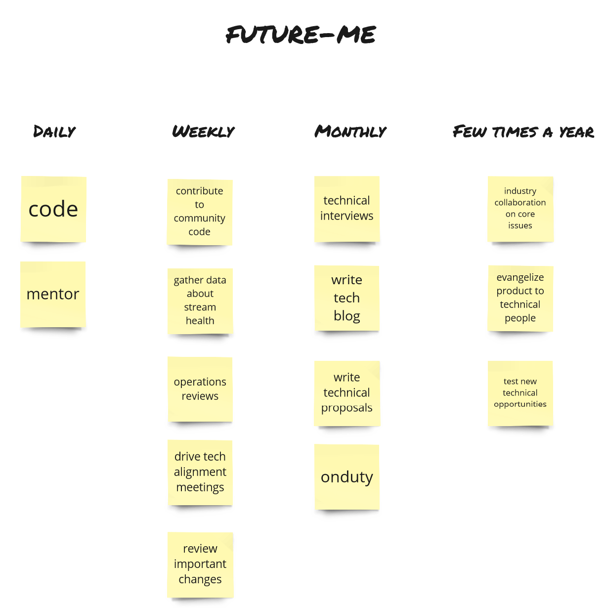
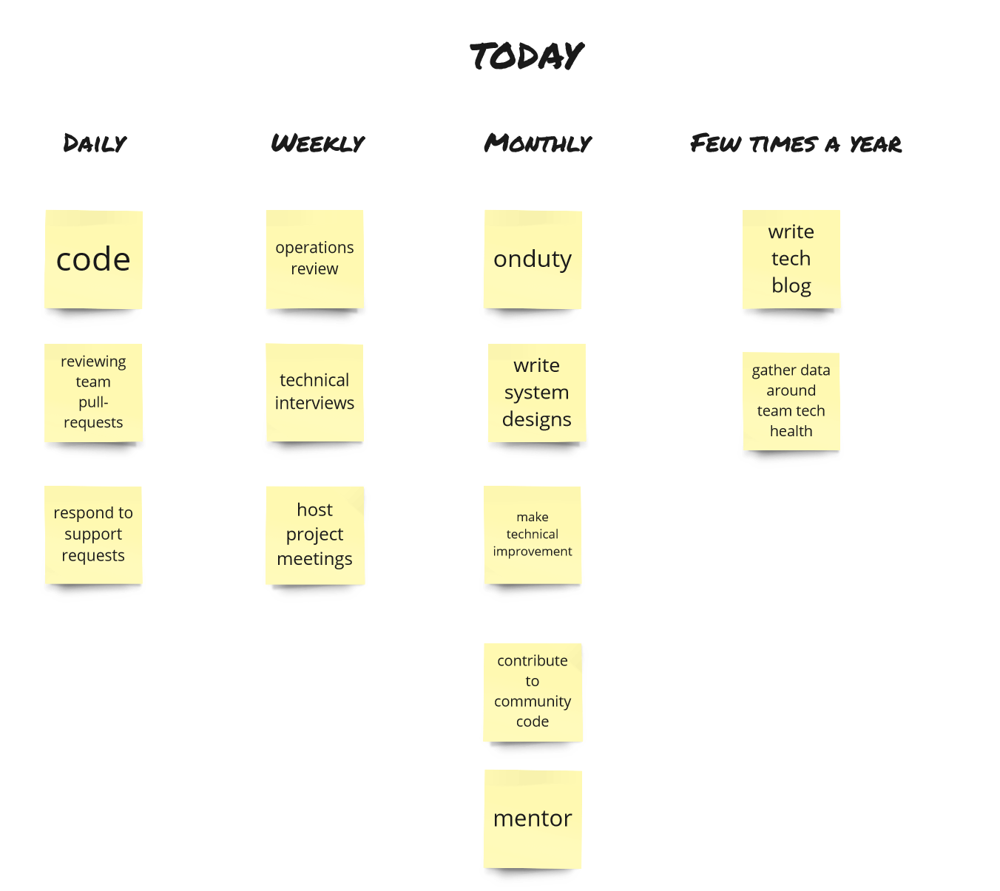
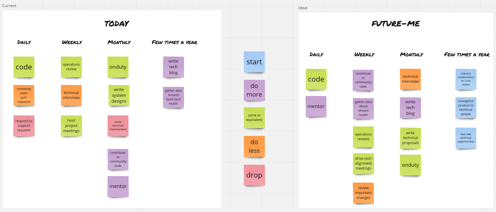
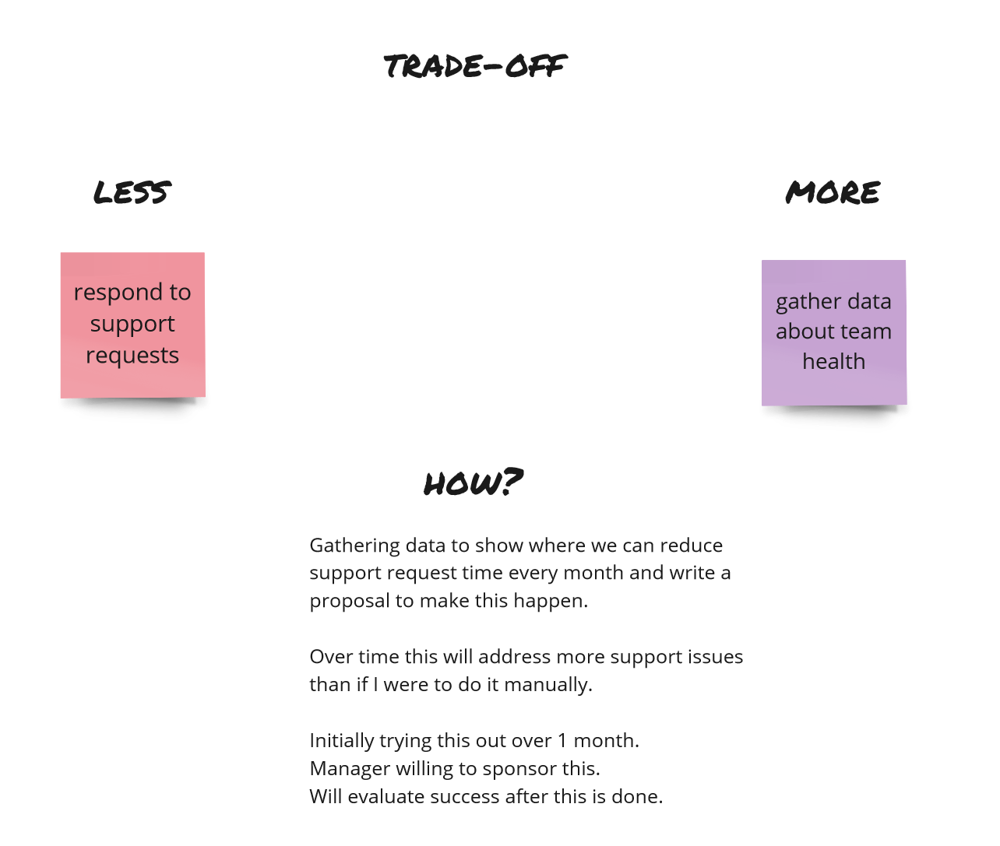

import { PullQuote, Card } from "../components"

On a fairly regular basis, I want to be able to answer these questions for myself both inside and outside of work:

 - What kind of person do I want to become?
 - What am I currently aiming to achieve?
 - Am I on the right track? 
 - When do I need to change the things I'm focussing on?
 - What am I currently trading off, and why?

That's a lot of relatively deep questions, and they were quite intimidating to answer initially. 
Over the past few years I've developed a system that helps me break down my aspirations in 
a way that I feel I can both answer these questions, and communicate the results with others.

## Who you are is what you do

First I want to establish the core concept of how I think about this system, which is "focus on behaviour".

The core thing we care about when we think of someone's progression in a career or skill is 
the **confidence** we have we have that someone can deliver on expectations **reliably**.
In almost all industries, delivering value reliably is difficult and non-intuitive, so it is highly unlikely to deliver value reliably from the get-go.
We address this by using tools, techniques, experience, and both social and financial resources to increase likelihood of success.
These generally take time to acquire and master. 
So, we often factor time and the resources a person has acquired in when we think about how confident we are that a person can operate at an advanced level.

However! _The_ most important thing that builds confidence seeing someone actually do something, regardless of how much prior experience they have. 
The only effective difference between a junior software developer and a principal software developer is the actions they take throughout a day.
A principal software developer will spend a large portion of their time taking understanding business goals, 
identifying critical gaps, understanding how to achieve goals, and motivating for key tech priorities.

A software developer that's fresh in the industry _could_ do the same thing. 
If they managed to make the right decisions, at the right time to deliver desired business value, on time, 
with the collaboration of others, then they could effectively start their career as a principal software developer.
When you are delivering like a principal software developer, you are a principal software developer. 
if you can play songs on a guitar, you are a guitarist. If you build things out of wood for a living, you are a carpenter.

A system that helps us advance should keep us accountable to actually doing things. It should focus on behaviour.

With that groundwork, lets introduce the system.

## Who do you want to be when you grow-up?

**The first step in our system is to imagine future-you.** 

This is a vision of the person you'd like to become. This can be based on someone real, who you admire. It can be an imaginary role model. I like to give my ideal-me a nickname to make it more personal "adult-Rick".

It does not need to be perfect, it doesn't even need to be great. It just needs to be _good-enough_ that reaching it would improve your life. 
We also don't need to fear committing ourselves to this vision. We will change as people, so will our goals and our aspirations. That's expected and we can amend this role model at any time.

This role-model gives us a direction we can use to build momentum.
In this system, the journey is more important than the destination. We want to focus on getting slightly better, constantly. 
We're banking that over time, these small gains compound into large improvements for you.

**Then ask yourself, "What does future-me _actually_ do? What are their _behaviours_?"** And write them down.
These are actions that future-you will be doing relatively often. I like to break it down by time period. 
It acknowledges that you don't do everything all the time and helps you think about where you want to spend most of your time:

 - what does future-me do daily?
 - what does future-me do weekly?
 - what does future-me do monthly?
 - what does future-me do a few times per year?

<figure>

<figcaption>Example: behaviours of future-me</figcaption>
</figure>

<Card> **Note again:** we're focusing on _behaviour_. We're keeping well-clear of we look like / feel / own / what others think of us.  
These can be important, but they're not the goal of this exercise. </Card>

## What are you doing now?

We have behaviours for our future-selves. **Now we want to list our current behaviours.**

The goal is to honestly see where you're spending most of your time. 
There's no judgment here; regardless of reasons this is the current situation we find ourselves in. 
We're just gathering facts about our situation so we can make a good decision about where to go from here.

I suggest doing this by following the same steps you did for your future-you:

 - what am I currently doing daily?
 - what am I currently doing weekly?
 - what am I currently doing monthly?
 - what am I currently doing a few times per year?

<figure>

<figcaption>Example: current behaviours</figcaption>
</figure>

**At this point we can do an initial evaluation.** Take a look at both sets of behaviours. 

Maybe something already stands out about future-you that you want to tweak, like a behaviour you're currently doing that you don't want to lose? Maybe future-you is doing too much every-day; keep the most important things to you and drop the others that can't be done everyday?

After these adjustments, we should now have a clear picture of which of your current behaviours should eventually be dropped, and which of future-you's behaviours you should eventually pick up.
Maybe you're already doing some of your future behaviours, but the frequency or scope you're doing them will need to change. I call this view a "heatmap". It gives me a sense of how far I am from achieving this future-vision of me.

<figure>

<figcaption>Example: behaviour heatmap</figcaption>
</figure>

The idea here is that if we can progressively change our current behaviours into future behaviours then we will, for all practical purposes, "become" our ideal future version of ourselves.

Using this heatmap, we can now take actions to improve.

## Next steps

**It's time to make a trade-off.** Pick one (1!) behaviour you're currently doing that should eventually drop or that you need to modify. 
Then pick a behaviour of your future-self that we want to eventually do. Now pick an action for yourself which which says _how_ you will do *less* of the thing you want to drop, and _how_ you will *attempt to do* the thing you want to do.

In many cases what you want to do might not be possible right away e.g. if future-you plays in a band once a month, then you need to be in a band. 
For these cases, identify a behaviour that gets you closer e.g. join community jam sessions every month where you can meet a band, or ask to jam with someone new every week.

**Give yourself a period to do this.** I like to use 2 or 3 week increments. 
If things go according to plan, at the end of this period you should be able to show yourself that you made _some_ progress towards your goal.
Maybe something you did daily that you wanted to drop only happens 4 times a week. Incremental progress is good; this is what we want.

If things do _not_ go according to plan, then we want make a change as soon as we notice a problem 
e.g. it might not be possible to drop one of your daily responsibilities without the sponsorship of your manager. 
So either pick another behaviour to change, or adapt your next goal to get you closer 
e.g. discuss with your manager under which conditions you may be able to do less of your daily responsibilities.

<figure>

<figcaption>Example: tradeoff</figcaption>
</figure>

## Seek out wisdom and sponsorship

Changing behaviour is hard, especially when the behaviour you want to adopt is new to you.

To help with this, I recommend finding a mentor that can help guide you and/or a sponsor that can make resources available to you that would have been hard to build up alone.
I've found these incredibly useful in making progress, doing it quicker, and doing it while sharing experiences with others.

## Keep going, keep talking

Periodically redo the exercise to update your ideal behaviours, reflect on your current behaviours, and pick an action that makes incremental progress to closing the gap between them.

If you write this down somewhere (I use Miro), you then have a platform to communicate to your colleagues and to reference your own notes in the future. 
I find it very helpful to let people at your work know your intentions, and this record gives a clear source of truth that you control to serve as a talking point with mentors, managers, and even people outside of work that care about what you're going through.

And that's it! I hope that one or more of this can prove useful in thinking about your own personal development. The very best of luck to you.