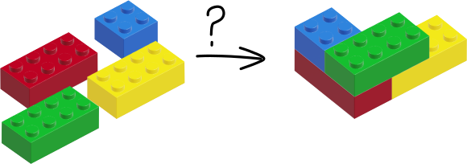
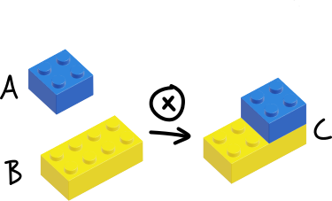
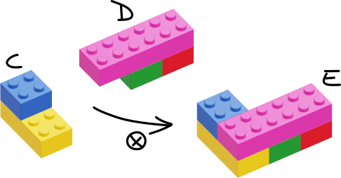
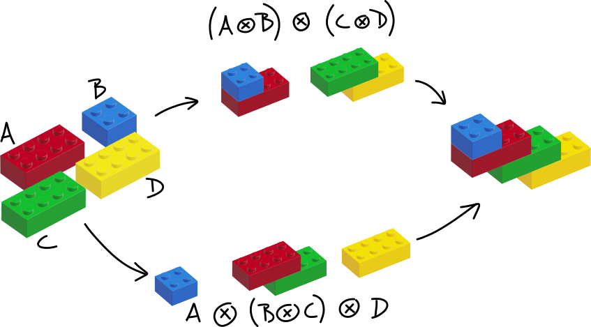
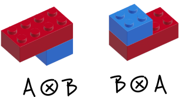

In this document we'll briefly go through how we can use the mathematical concept of a monoid to help us design and build systems that enable composition.

## Why should I care about composition?

Composition is the idea that complex problems can be solved by combining the solutions of many simpler problems.
This idea is a fundamental one in programming, where complex software that would be impossible for any individual programmer to tackle can
be built up of individual small programs that are easy to reason about/program/test.

Given the importance of composition in our field, having knowledge of techniques that enable composition can enable you build software faster, safer and more maintainably.

There are multiple ways to approach composition. One approach is to do it mathematically: by defining a system of rules that work together to _guarantee_ composability. While there are many mathematical systems that enable composability, we'll be taking a look at one in particular that's proven itself to be useful when programming: monoids.

## Monoids

The "monoid" is the name of a concept in mathematics. That concept lays out a system which, when applied, will guarantee composability. The system is made up of the following:
a grouping of items that can be composed; an operation that you can use to compose these items; and some rules that both the items and the operation need to follow so that the system has useful properties.

To build an intuitive understanding of how this system works, we'll look at each part of the system and how it can be used to compose LEGO bricks together into a larger structure.

<span className="quicksand text-sm">
  Disclaimer: Please note that LEGO® is a trademark of the LEGO Group of
  companies which does not sponsor, authorize or endorse this site. I'm using
  LEGO bricks here mainly to help build up an intuition around the subject using
  a toy that many readers are likely to be familiar with.
</span>

<div className="mb-8"></div>

## The Monoidal Product

Lets start with a set of blocks that we want to compose together:


<figure>

</figure>

First up, we need an operation that can compose just two elements.
For this discussion, we'll say that our operation takes two blocks and
clips the first block on top of the second block.
This operation that can compose two elements is called **the monoidal product**
and we'll use the symbol **⊗** represent this composition e.g. using the monoidal product to compose A and B into C is written like this `A ⊗ B = C`

<figure>

</figure>

For our product to work consistently, we also need to consider the blocks themselves. Notice how the LEGO blocks share attributes that allow them to be composed together: they have studs on the top and a structure on the bottom that can clip onto studs.
In other words, these specific LEGO bricks are part of the larger
**set\* of LEGO blocks** that have studs at the top and the ability to clip onto studs at the bottom.

<span className="text-sm">
  * A set is the mathematical term for a group of items that share properties.
</span>

<div className="mb-8"></div>

We've considered the product itself and the inputs it can take in, now we also need to consider the result produced by the
product. Take a look at the result `C`. It too is part of the set of LEGO bricks:
it has studs at the top and could also clip to studs at the bottom\*\*. It is crucial that the
monoidal product, which takes 2 items from a set, creates an output that is also an item in the set. The reason why this is important,
is that this allows us to take the result and use it as an input in another monoidal product, composing it further.
This conceptually allows us to keep composing items together infinitely.

<span className="text-sm">
  ** This seems obvious when we look at LEGO, but in maths or in our programs,
  the output of an operation isn't always the same type as the inputs.
</span>

<figure>

<figcaption>First condition for a monoid: we need a **monoidal product** that **takes two items in a set** and **returns an item in the same set**.</figcaption>
</figure>

## Associativity

We now have the core of a system that allows composability, but we need to define some more rules that help make this system easy to work with.

The first of these is that we want to be able to perform compositions in any order. The picture below shows how two different composition orders for `A ⊗ B ⊗ C ⊗ D` result in the same end composition.

<figure>

</figure>

Why is this a useful property to have in our system? It allows us to break up work. For example: if you have multiple people helping you build `(A ⊗ B) ⊗ (C ⊗ D)`, you can have person 1 do `(A ⊗ B)`, person 2 can do `(C ⊗ D)` and person 3 can take the results from person 1 and person 2 and compose them together into the final result. This is the key principle behind assembly lines in factories and parallel processing in software systems. This property of not caring for which operation is performed first is called **associativity**.

An important note here that the "position" of the items still makes a difference: `A ⊗ B` is not the same as `B ⊗ A`. The above is about the order in which you perform the monoidal product.

<figure>

<figcaption>Second condition for a monoid: the monoidal product must be **associative**.</figcaption>
</figure>


## Identity

The last thing we need to consider is that what we're building is a mathematical system. Mathematical systems, both in pure-maths and when part of software systems, don't know the exact data/information they will be working with ahead of time. In the case of composability, we won't know the number of items we'll need to compose together ahead of time. So our system needs to be able to handle any number of items. How do we handle the case where we're given _a single item_ given that we've built a system on top of the monoidal product, which composes _two_ items together?

Here's where our example with LEGO blocks breaks down a bit. In real life, if we're given a single block we know that we don't need to do anything; there's nothing to attach that block to so we don't even try to apply the operation. In many situations - software processes in particular - we don't get to make that choice: we _have_ to run the operation every time the system is given something. The mathematical solution around this is rather sneaky and seems almost petty. We just _invent_ an item in the set and we _define it_ so that it doesn't do anything if it is used in the monoidal product. We call this item the **identity** and I'll use the symbol `i` for simplicity here (though `e` is often used as the symbol most often). With the identity we have `A ⊗ i = A` and `i ⊗ A = A`.

Here are some examples of identities that exist in arithmetic:

- If we take the operation `+`, 0 is our identity: `4 + 0 = 4` and `0 + 4 = 4`
- If we take the operation `*`, 1 is our identity: `7 * 1 = 7` and `1 * 7 = 7`

The identity also helps us deal with another case: the one where we're asked to compose an empty list of items. In this case, we can fall back to running the operation on two identities: `i ⊗ i = i`

> <small>
>   Third condition for a monoid: the set we're using in our monoid must have an
>   **identity** which, when used with another item in the monoidal product will
>   result in the other item.
> </small>

And that's it. We have three conditions that give us a mathematical system that we can use and which mathematically guarantees composition:

1. There is a **monoidal product** that **takes two items of a set** and **returns an item in the same set**.
2. The monoidal product must be **associative**.
3. There is an **identity** in the set which, when used with another item in the monoidal product, will result in the other item.

So what do monoids look like in practice? Ironically, our LEGO blocks example is not a monoid: we saw that this system doesn't have an identity . There are several monoids in arithmetics: the set of real numbers, the monoidal product `+` and the identity `0` form a monoid; the set of real numbers, the monoidal product `*` and the identity `1` also form a monoid. We can also design them when writing software.

## Example monoid in code

Let's design a monoid that allows us to combine wishlists of stuff that our loved ones want.

```javascript
/**
 * We define a set of items with similar attributes that we want to compose:
 *
 * @typedef { { type: "normal" | "identity"; totalCost: number; items: string[]; } } Wishlist
 *
 * Note that we've given us a way to determine the identity as part of this set.
 */

/**
 * We define our identity in a convenience function that allows us to create
 * a new identity object.

 * @returns {Wishlist} the identity
 */
function getIdentity() {
  return { type: "identity", totalCost: 0, items: [] }
}

/**
 * Our monoidal product
 *
 * It takes in two wishlists and returns a combined wishlist.
 *
 * @param {Wishlist} wishlistA
 * @param {Wishlist} wishlistB
 * @returns {Wishlist} the combined wishlist
 */
function combineWishlists(wishlistA, wishlistB) {
  // We force our identity to have no effect
  if (wishlistA.type === "identity") {
    return { ...wishlistB }
  }

  if (wishlistB.type === "identity") {
    return { ...wishlistA }
  }

  return {
    type: "normal",
    totalCost: wishlistA.totalCost + wishlistB.totalCost,
    items: [...wishlistA.items, ...wishlistB.items],
  }
}

/**
 * Tests to assert the rules needed for a Monoid
 */

const assert = require("assert")

;(function testAssociativity() {
  const wishlistA = { type: "normal", totalCost: 10, items: ["foo", "bar"] }
  const wishlistB = { type: "normal", totalCost: 200, items: ["baz"] }
  const wishlistC = { type: "normal", totalCost: 15, items: ["qux", "bar"] }

  // test (A x B) x C is the same as A x (B x C)
  const resultA = combineWishlists(
    wishlistA,
    combineWishlists(wishlistB, wishlistC),
  )
  const resultB = combineWishlists(
    combineWishlists(wishlistA, wishlistB),
    wishlistC,
  )
  assert.deepStrictEqual(
    resultA,
    resultB,
    "The monoidal product is not associative.",
  )

  // sanity check for the actual values (should likely be tested in its own tests)
  assert.deepStrictEqual(
    {
      type: "normal",
      totalCost: 225,
      items: ["foo", "bar", "baz", "qux", "bar"],
    },
    resultA,
  )
})()
;(function testIdentity() {
  const wishlistA = { type: "normal", totalCost: 10, items: ["foo", "bar"] }

  const oneWay = combineWishlists(wishlistA, getIdentity())
  assert.deepStrictEqual(
    oneWay,
    wishlistA,
    "The monoidal product with the identity in the second argument does not return the first argument",
  )

  const otherWay = combineWishlists(getIdentity(), wishlistA)
  assert.deepStrictEqual(
    otherWay,
    wishlistA,
    "The monoidal product with the identity in the first argument does not return the second argument",
  )

  const identities = combineWishlists(getIdentity(), getIdentity())
  assert.deepStrictEqual(
    identities,
    getIdentity(),
    "The monoidal product on identities does not result in an identity",
  )
})()
```

Now that we've defined our monoid, let's use it.

```javascript
/**
 * Composes wishlists of family members together
 */
function getFamilyWishlist() {
  const wishlistDad = {
    type: "normal",
    totalCost: 100,
    items: ["Running shoes"],
  }

  const wishlistBro = {
    type: "normal",
    totalCost: 300,
    items: ["Concert tickets", "Video game subscription"],
  }

  /**
   * Compose all the wishlists together using reduce.
   *
   * What will happen in the reduce:
   * step1: compose identity and wishlistDad
   * step2: compose result of step1 and wishlistBro
   */
  const initialValueForOurComposition = getIdentity()
  const familyWishlist = [wishlistDad, wishlistBro].reduce(
    combineWishlists,
    initialValueForOurComposition,
  )

  console.log(familyWishlist)
  // Output:
  // {
  //   type: 'normal',
  //   totalCost: 400,
  //   items: [ 'Running shoes', 'Concert tickets', 'Video game subscription' ]
  // }

  return familyWishlist
}

/**
 * Composes wishlists of friends
 */
function getFriendsWishlist() {
  const wishlistBob = {
    type: "normal",
    totalCost: 50,
    items: ["Chef knife"],
  }

  const wishlistJen = {
    type: "normal",
    totalCost: 25,
    items: ["Sci-fi novel"],
  }

  // Terser version of the functionality in the getFamilyWishlist function
  return [wishlistBob, wishlistJen].reduce(combineWishlists, getIdentity())
}

/**
 * Compose family and friend wishlists together
 *
 * Note: because of associativity, you could run getFamilyWishlist()
 * and getFriendsWishlist() in parallel threads and compose them together later
 */

const wishlistFinal = combineWishlists(
  getFamilyWishlist(),
  getFriendsWishlist(),
)

console.log(wishlistFinal)

// Output:
// {
//   type: 'normal',
//   totalCost: 475,
//   items: [
//     'Running shoes',
//     'Concert tickets',
//     'Video game subscription',
//     'Chef knife',
//     'Sci-fi novel'
//   ]
// }
```

## Recap/TLDR

A monoid is a mathematical system made up of:

1. a set of items you want to compose together
1. a monoidal product that:
   - takes in two items in the set and composes them into an item that is also in the set
   - is associative
1. an identity in the set that we can use in the monoidal product when we need to apply it on a single item or an empty list.

The properties of monoids guarantee that we can infinitely compose items together and this composition can be done in parallel.

We can design monoids in our software to take advantage of their properties.
