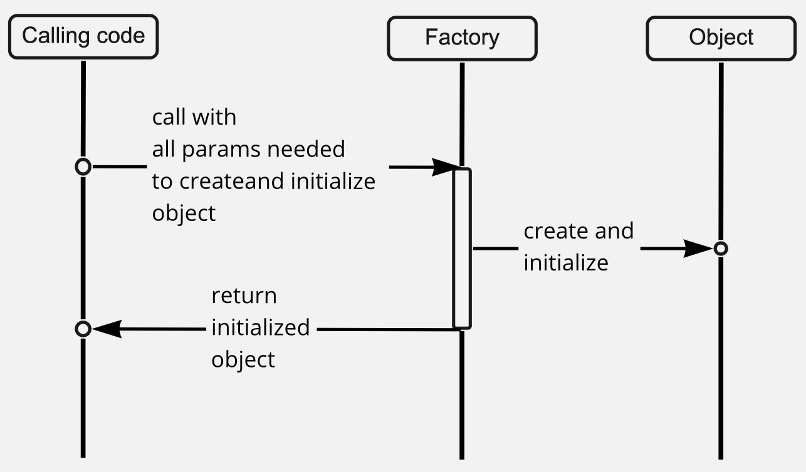

import Link from "next/link";

**TLDR** A "factory" is a <Link to="/articles/patterns">pattern</Link> which encapsulates logic for creating new instances of classes.

## Problem/context

Logic which determines which objects need to be created can be complex. That complexity can leak into other concerns in your code, making it harder to understand and harder to maintain.

This problem is found often in object-oriented codebases that make heavy use of polymorphism. In these codebases you often need to determine which implementation of an interface needs to be created, depending on configuration, user input and/or app state.

## Concept

The core idea is to encapsulate the logic that determines when an object needs to be created.



**Key characteristics**

- Factories return instance of classes (as opposed to data).
- [My own definition] Factories always return _new objects_ i.e. calling a factory twice should give you two objects. The results from the factory can be cached, but the factory itself should not cache.
- Factories get given all the information to construct the object up-front: either in the their constructor (if they're a class), as parameters to the factory function, or a combination of both. This is a key difference between patterns like Builders which configure new objects progressively.

## Examples

A **factory class** that creates a new hero object according to player choices.

```typescript
class PlayerHeroFactory {
  private difficulty: GameDifficulty

  constructor({ difficulty }: { difficulty: GameDifficulty }) {
    this.difficulty = difficulty
  }

  get({ name, heroType }: PlayerChoices): PlayerHero {
    const hardMode = this.difficulty === "hard"
    const startingHealth = hardMode ? 50 : 100

    switch (chosenHero) {
      case "swordsman":
        const weapon = hardMode ? "stick" : "sword"
        return new Swordsman({ name, startingHealth, weapon })
      case "magician":
        const spell = hardMode ? "ignite" : "fireball"
        return new Magician({ name, startingHealth, spell })
    }
  }
}

type GameDifficulty = "normal" | "hard"
```

A **factory method** in a board-game class that creates a new initial board depending on the starting number of players.

```typescript
// Note: several class definitions have been left out for brevity

class BoardGame {
  private board: Board

  constructor({ numberOfPlayers }: { numberOfPlayers: number }) {
    this.board = getInitialBoard({ numberOfPlayers })
  }

  private getInitialBoard({
    numberOfPlayers,
  }: {
    numberOfPlayers: number
  }): Board {
    switch (numberOfPlayers) {
      case 4:
        return new FourPlayerBoard()
      case 3:
        return new ThreePlayerBoard()
      case 2:
        return new TwoPlayerBoard()
      default:
        throw new Error(
          `Cannot create a new board for ${numberOfPlayers} players`,
        )
    }
  }
}
```

A **factory function** which creates a new <Link to="/articles/pattern-interceptor">interceptor</Link> depending on application configuration.

```typescript
// Note: several class definitions have been left out for brevity

function getLoggingInterceptor({
  devMode,
  remoteLogging,
}: AppConfig): Interceptor {
  if (devMode) {
    return new ConsoleLoggingInterceptor()
  }

  if (remoteLogging) {
    return new RemoteLoggingInterceptor()
  }

  return LocalLoggingInterceptor()
}
```
