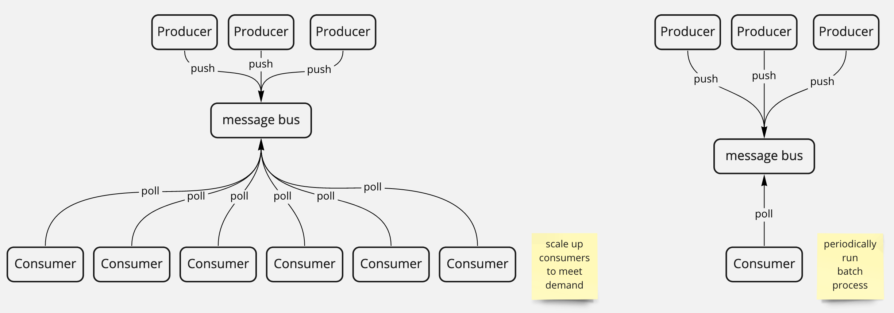

import Link from 'next/link";
import ProducerConsumerSequenceDiagram from "./images/producer-consumer-sequence.svg"

<div>
  <b>TLDR</b> "Producer" and "consumer" form a{" "}
  <Link href="/articles/patterns">pattern</Link> which enables systems to decouple
  generation of work from processing of work.
</div>

## Problem/context

When our system needs to perform some work, but the parts of the system that perform the work need to behave very differently to the parts of the system that generate the requests for that work.

Examples of senarios where processing and requests behave differently:

- You need to decouple time between requests for work are generated and when that work is done
  e.g. you get requests which you want to process when processing power is cheaper
- You need to decouple the number of requests from the number of jobs that process the requests
  e.g. you can get many requests, which you process in batches
- You need to scale the capacity to do work differently from the capacity that generates work
  e.g. you need to be able to add or modify processing units to handle larger requests, even if the number of requests is the same

## Concept

Split the system into two roles:

1. One or more **producers** create work and place it into some storage e.g. a queue.
1. One or more **consumers** fetch work requests from the storage and perform the work.

<div className="mb-5">
  <ProducerConsumerSequenceDiagram />
</div>

This allows systems to scale producers and consumers independently of one another.
The producers and consumers also don't care about implementation details;
you can have a mix of different types of consumers and producers as long as they all speak to
the same message bus and respect a common definition for messages.



**Key characteristics**

- A common message-bus which can store requests (a.k.a. messages)
- A set of producer processes which push messages onto the bus
- A set of consumer processes which pull messages from the bus

**Notes**

- The message bus is a single point of failure; closely monitor its performance and limits.
- Both consumers and producers can be scaled horizontally.

## Examples

A toy producer-consumer system.

In this case the consumers are underscaled, when running this, note how the messages on the bus grow over time.
More consumers can be instantiated until messages on the bus consistently are processed without the size growing continuously.

```typescript
/**
 * Usage
 */
const messageBus = new MessageBus()

new Producer(messageBus, "expensive")
new Producer(messageBus, "cheap")
new Producer(messageBus, "cheap")

new Consumer(messageBus)
new Consumer(messageBus)
new Consumer(messageBus)

/**
 * Definitions
 */
type MessageType = "cheap" | "expensive"
type Message = { type: MessageType }

class MessageBus {
  messages: Message[] = []

  constructor() {
    this.printOutSize()
  }

  async printOutSize() {
    while (true) {
      await new Promise(resolve => setTimeout(resolve, 200)).then(() => {
        console.log("messages on bus: " + this.messages.length)
      })
    }
  }

  push(message: Message) {
    this.messages.push(message)
  }

  pull() {
    return this.messages.shift()
  }
}

class Producer {
  bus: MessageBus
  messageType: MessageType

  constructor(bus: MessageBus, type: MessageType) {
    this.bus = bus
    this.runRequestLoop()
    this.messageType = type
  }

  async runRequestLoop() {
    while (true) {
      await this.pause()
      this.bus.push({ type: this.messageType })
    }
  }

  async pause() {
    return new Promise(resolve => setTimeout(resolve, 500))
  }
}

class Consumer {
  bus: MessageBus

  constructor(bus: MessageBus) {
    this.bus = bus
    this.runWorkLoop()
  }

  async runWorkLoop() {
    while (true) {
      const message = this.bus.pull()
      if (message) {
        await this.processMessage(message)
      } else {
        await this.pause()
      }
    }
  }

  async processMessage(message: Message) {
    switch (message.type) {
      case "cheap":
        return new Promise(resolve => setTimeout(resolve, 200)).then(() =>
          console.log("cheap work done"),
        )
      case "expensive":
        return new Promise(resolve => setTimeout(resolve, 1500)).then(() =>
          console.log("expensive work done"),
        )
    }
  }

  async pause() {
    return new Promise(resolve => setTimeout(resolve, 100))
  }
}
```
