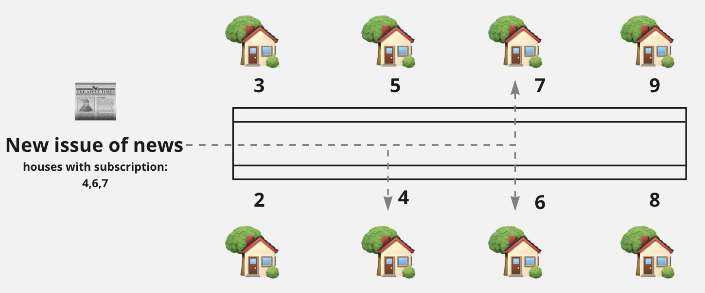

**TLDR** "Publisher" and "subscriber" form a <Link href="/articles/patterns">pattern</Link> which enables objects to communicate asynchronously.

## Problem/context

If we have a single concern that needs to trigger multiple other concerns, how can we have a setup that allows us to change or scale the concerns that need to be notified?

## Concept

There are two roles:

1. A **publisher** which gets triggered by a single event that needs to be distributed.
1. One or more **subscribers** which are _registered_ with the publisher and which get notified by the publisher when it is triggered.

<figure className="flex flex-col items-center">

</figure>

**Key characteristics**

- One-way communication from publisher to subscriber; the publisher shouldn't care about what the subscribers do; this is not a request-response interaction.
- Subscribers can register or deregister with/from the publisher whenever they want.

## Examples

A "general" channel in a chat-app that sends messages to all active members.

```typescript
// Note: some class definitions and implementation details have been left out for brevity

/**
 * Usage
 */
const generalChat = new GeneralChat()

// user 1 logs on
const user1 = new User()
generalChat.register(user1)

// user 2 logs on
const user2 = new User()
generalChat.register(user1)

// someone types in the chat
generalChat.newMessage("I fear for the calendar. It's days are numbered.")

// user 2 logs off
generalChat.deregister(user2)

/**
 * Definitions
 */
class GeneralChat {
  private connectedUsers = new Set<User>()

  register(user: User[]) {
    connectedUsers.add(user)

    // notify general chat when a new user enters the chat
    this.newMessage(`${user.username} has entered the chat`)
  }

  deregister(user: User[]) {
    connectedUsers.delete(user)

    // notify general chat when a new user leaves the chat
    this.newMessage(`${user.username} has left the chat`)
  }

  newMessage(message: string) {
    for (let user of this.connectedUsers) {
      if (user.isActive()) {
        user.notifyGeneralChat(message)
      } else {
        // remove inactive users
        deregister(user)
      }
    }
  }
}

class User {
  notifyGeneralChat(message: string) {
    // show the message in the user's general chat
  }

  isActive() {
    // perform check to determine if the user is still active
  }
}
```

A real-word newsletter which sends new issues when they are published.


