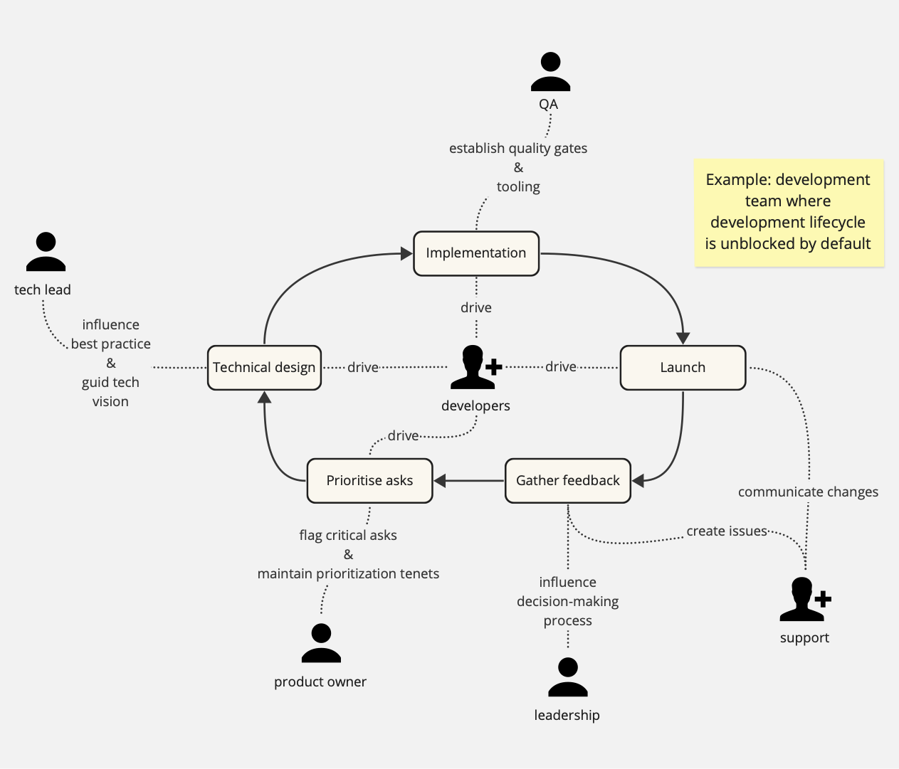

This document describes a set of risks for teams made up of mutliple roles, and proposes an approach for mitigating them.

## Context and risks

Teams are made up of multiple different roles to allow us to divide labour. It enables focus on our day-today work, promotes the development of expertise, and pushes collaboration. 
When done well, division of roles boosts productivity and raises the quality of work.

The tradeoff is that team members become less effective at delivering value individually.
Specialization, by defnition, means that knowledge and capability are consolidated into fewer individuals, 
which makes the group more prone to becoming blocked if these indivuals are not able to make progress with their tasks. 
This high dependency on the output of other roles places a greater importance on aligning expectations between roles, as
there is a strong possibilty that misaligned expectations will result in one role becoming blocking to another role. 
Finally, getting this right is made harder by the lack of consistency around role definitions and expectations in today's tech industry, 
so companies and teams need to define, align-on and implement their own systems of inter-dependent specializations.  

## The role-mapping protocol

The following protocol can be used for setting explicit expectations within a multi-role team that are relevant to the team's context:

1. **Identify recurring tasks** that the team needs to complete in order to deliver value. These can be as broad or granular as needed, but bias for high-level tasks initially.
Examples: prioritize customer asks, implement features, address support requests, define analytics requirements, own iteration process for the product lifecycle.
2. **Identify which tasks can block for delivery** of "standard" work. Examples: implementing a feature is blocking; improving the team's agile processes is not.
3. **Map tasks to roles**, with the following guidelines:
    - Roles that have a single person SHOULD NOT have tasks which can block delviery of "standard" work.
    - Roles that have a single person SHOULD have tasks that modulate (speed-up/scale/slow-down) the delivery of other roles.
    - All roles SHOULD set expectations that individuals can independently drive delivery of tasks mapped to that role.
    - Tasks that are blocked by multiple roles or multiple people SHOULD be re-worked into separate tasks to enable independent delivery.

## Protocol properties

This protocol aims to establish expectations for teams which have the following properties:
 - Standard value delivery is by default never blocked. It is driven by roles which form an "engine" to deliver value.
 - Roles that have few people enhance the speed/scale/quality of delivery without blocking it. They "tune the engine".
 - All roles are empowered and encouraged to deliver value. Minimal downtime due to alignment cross-roles or due to a missing role.

## Further guidelines

 - Teams MUST NOT establish role expectations without establishing the tasks that the team needs to perform. It is easy to end up with orphaned/oversubscribed tasks, or implicitly expectations for task delivery.
 - Teams MUST be flexible with role expectations. The team must be able to make adjustments as experience, context and team composition evolves.

## Limitations

 - The results of the mapping can highlight role expecations that are in tension with an individual's contractual expectations.
 - This protocol will not be effective with individuals that will not, or cannot, accomodate for alterations in role expectations.
 - This protocol assumes teams that are composed in majority by individuals that can deliver individually, which may have base requirements for professional skill and/or experience.
